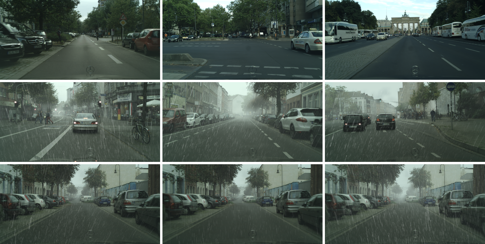
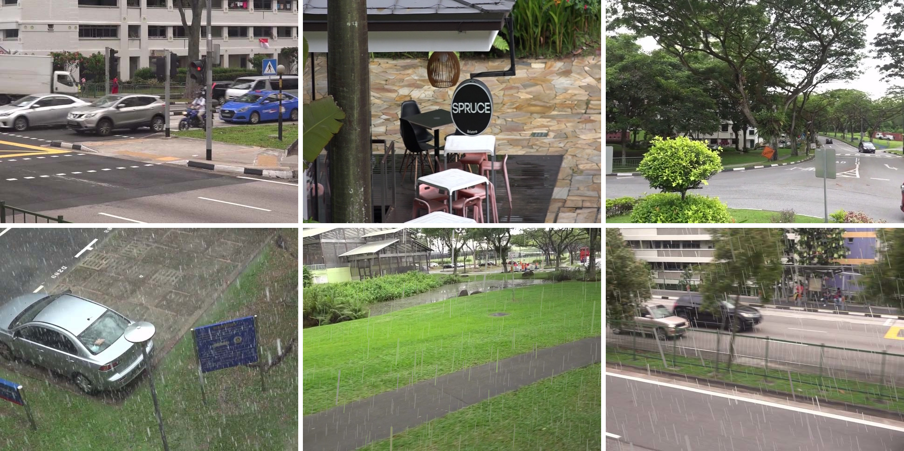
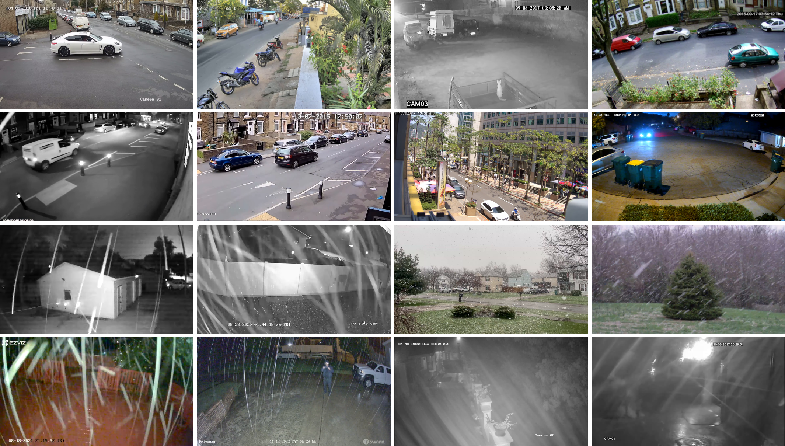

# 🌧️ CCTV Precipitation Detection

Machine learning-based algorithm to automatically detect precipitation (rain, snow) in CCTV footage.


Developed as part of my engineering thesis at the AGH University of Science and Technology, this project combines Computer Vision and Convolutional Neural Networks (CNNs) to increase road safety by recognizing adverse weather conditions using industrial surveillance cameras.

---

## Project Overview

**Goal:** Detect precipitation (rain or snow) in CCTV images.

**Motivation:**  
Poor weather significantly reduces road visibility and increases accident risk.  
Early precipitation detection can improve traffic control systems and enhance public safety.

**Approach:**
- Created a large custom dataset (~20 different real CCTV sources + synthetic data).
- Built and evaluated multiple CNN architectures with TensorFlow/Keras.
- Focused on real-world conditions: low-resolution video, night vision, occlusions.

---

## Project Structure

| Folder | Description |
|:---|:---|
| `data/` | Organized raw and processed datasets (images). |
| `dataset_preparation/` | Scripts for data extraction, cleaning, augmentation, and set preparation. |
| `models/` | CNN training and evaluation scripts. |
| `saved_models/` | Trained models and class labels. |
| `reports/` | Generated training plots and evaluation results. |

---

## Key Features

### Custom Data Preprocessing:
- Median filtering for noise removal.
- Data normalization and augmentation to fight overfitting.

### Multiple CNN Architectures:
- Tested shallow and deep variations.
- Used dropout and learning rate scheduling for regularization.

### Evaluation:
- Accuracy, Precision, Recall, F1-Score metrics.
- 4-fold Cross Validation for robust evaluation.

---

## Dataset Details

Collected and processed from:
- Real-world CCTV footage (self-collected and public datasets).
- Synthetic rain datasets (RainCityscapes, Synthetic Rain Dataset with Adobe After Effects).
- Traffic surveillance datasets under different weather conditions.
- Manual frame extraction from YouTube videos.

**Classes:**
- Precipitation
- No Precipitation

> **Note:** Dataset is not included in this repository due to size. Please contact the author if you need access to the dataset.

---

## Results

The best-performing model achieved the following results:

| Metric       | Value   |
|:---          |:---     |
| Accuracy     | 96.74%  |
| Precision    | 95.83%  |

Plots for training/validation accuracy and loss curves are available in the [`reports/plots/`](./reports/plots) folder.

> **Note:** Full metric reports (Excel files) were generated but are not included here due to size and formatting.

---

## Installation

```bash
git clone https://github.com/yanamis/cctv-precipitation-detection.git
cd cctv-precipitation-detection
pip install -r requirements.txt
```

---

## How to Train and Evaluate

To prepare data splits:

```bash
python dataset_preparation/element_distribution.py
python dataset_preparation/train_dataset.py
python dataset_preparation/test_dataset.py
```

To train the model:

```bash
python models/model.py
```

To evaluate the model:

```bash
python models/evaluate_model.py
```

---

## References

This project builds upon the works of:
- TensorFlow and Keras open-source communities.
- Various academic papers on CNN-based weather detection.
- Public datasets like RainCityscapes, AAU RainSnow, and more.

---

## Author

**Yana Mishula**  
Bachelor's Thesis in Telecommunications (Teleinformatyka), 2023  
AGH University of Science and Technology, Kraków, Poland.

---

## Acknowledgments

Special thanks to Dr. Andrzej Matiolański for guidance and supervision.

---

## Example Images

Some examples of challenging weather conditions and different CCTV sources used during model training:

### RainCityscapes Dataset (Synthetic Rain on Cityscapes)


### Synthetic CCTV Rain Dataset (Real CCTV + Artificial Rain)


### YouTube CCTV Dataset (Real Surveillance Footage)


---

